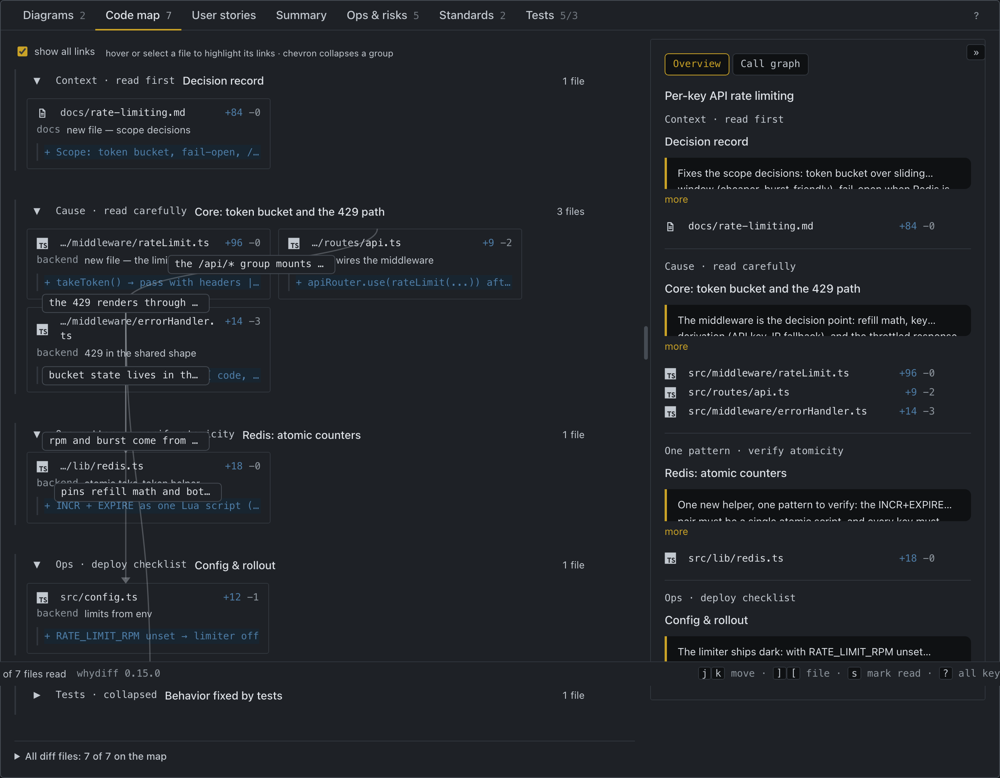
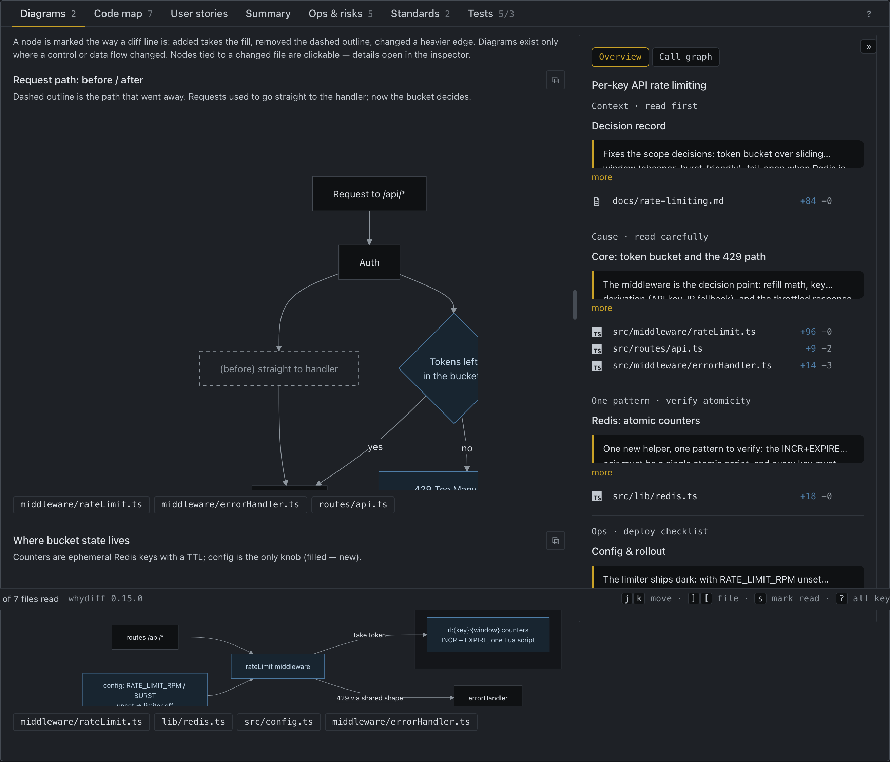
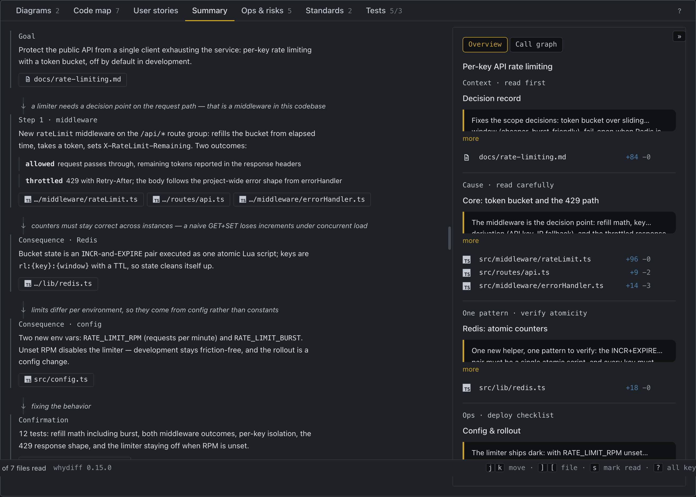
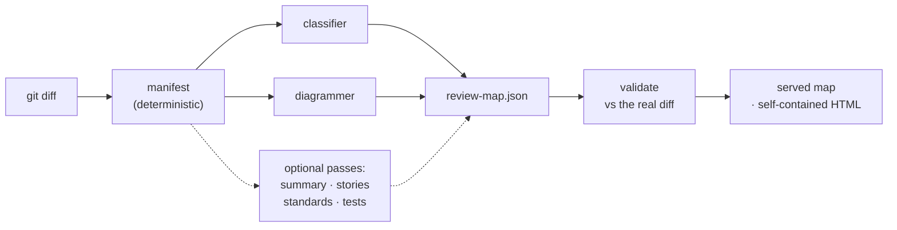

# whydiff

[](https://github.com/smagew/whydiff/actions/workflows/validate.yml)
[](https://docs.claude.com/en/docs/claude-code)
[](https://github.com/smagew/whydiff/releases)
[](LICENSE)

**Follow the meaning of a change — the decisions behind it — instead of reading
thousands of diff lines to reconstruct them.**

whydiff turns a git diff into a **change map** you review in a browser: why each
change exists, what it changed for the people using the product, diagrams of the
flows it actually altered — and one click from any claim to the code it came from.

*Runs on your machine · one self-contained HTML file · nothing leaves it except
through your own Claude session ([SECURITY.md](SECURITY.md)).*

<!-- Screenshots carry the version they show: a changed picture gets a new filename,
     so neither a browser nor GitHub's CDN can keep serving the previous one. -->



An LLM writes code faster than anyone can read it. Reviewing every file line by line
burns the speed you just gained; skipping the review costs you your mental model of
the project. whydiff is the third option: read the decisions, open the code only
where it matters, and let a script — not the model — prove that no file went
unexplained.

## Install

The repo doubles as a plugin marketplace, so a normal persistent install works:

```
/plugin marketplace add smagew/whydiff       # or a path to a local clone
/plugin install whydiff@whydiff
```

Needs [Claude Code](https://docs.claude.com/en/docs/claude-code). The assembler's
bundles (mermaid, highlight.js) install themselves on the first run. Later:
`/plugin marketplace update whydiff` pulls a new version. Plugin skills are
namespaced, so `/whydiff:whydiff` always works when the bare `/whydiff` is ambiguous.

So a run doesn't ask a dozen times, the plugin ships a `PreToolUse` hook that
auto-approves **only** its own pipeline: its bundled scripts, read-only `git`, writes
inside `.whydiff/`, and opening the built map. Anything else — and any command with
chaining or substitution — goes through the normal permission flow
(`scripts/approve.mjs` is deliberately short and reviewable).

## Use it

```
/whydiff                    # working tree vs HEAD (incl. untracked)
/whydiff HEAD~3             # a commit range
/whydiff main..feature      # any git range
```

The run **serves** the map on `http://127.0.0.1:<port>/` and opens it in your
browser. Served means live: you can ask about any part of it, pin notes, instruct a
change, and add the optional passes with a **Generate** button. Ask for a file to
keep — to send someone, or to publish — and you also get one self-contained
`.whydiff/<date>-<slug>.html` that needs no server and no network.

The report is written in the language you were speaking; code and identifiers stay
as they are.

## What you read there

| Question | Where it lands |
|---|---|
| Which flows and data shapes actually changed? | **Diagrams** — one diff-marked graph per changed flow; an `er-diff` for a schema migration |
| What was changed, and why does this bit exist? | **Code map** — files grouped by *cause*, not by folder, with labeled links between them |
| What changed for the people using this, and did it land? | **User stories** — one per outside-visible capability, each with a `delivered` / `partial` / `broken` / `regressed` verdict read off the code |
| What was decided, and why did one decision lead to the next? | **Summary** — a causal walkthrough, every block linked by a *why* |
| What do I do at deploy time? | **Ops & risks** — env, migrations, deploy steps, and the blast radius outside the diff |
| Does it follow this project's own conventions? | **Standards** — each finding with the convention it deviates from |
| What is guaranteed now, and what is still uncovered? | **Tests** — fixed behaviours vs. gap analysis, not a coverage percent |
| Was anything left unexplained? | The file manifest: N of N, proven by `validate.mjs` rather than asserted by the model |

A default run builds the first two tabs and Ops; the rest are one **Generate** click
away, so a quick look stays quick.

| Diff-marked diagrams — click a node to open the file | The Summary: a causal walkthrough |
|---|---|
|  |  |
| **Review** — the merge gate: what blocks, and the decision manifest | **Options** — two or three ways to deal with a finding, each with its cost |
|  |  |

## Working in the map

Select a story card, a Summary block, a diagram node (or drag a rectangle over part
of a diagram), or any text — and the panel opens in one of four modes:

- **Ask** — a question about *this* place, answered by `claude -p` against the real
  repo. The answer leaves a numbered pin where you asked, and a bookmark in the rail.
- **Note** — a plain remark pinned there. No model involved.
- **Instruct** — say what should change; the reply is a *plan* (files, what proves it
  done, what could break, what must be answered first) you agree to or turn down.
- **Options** — offered on a problem the map found: two or three ways to deal with it
  that differ in kind (fix the symptom / fix the invariant / pin it with a test), each
  with cost, risk and the criterion it would be judged by.

Nothing is edited. The CLI runs under a read-only allowlist, and everything you agree
to becomes a task in an append-only **review journal** (`.whydiff/review.log.jsonl`)
that survives the tab closing and a regenerated map.

Those tasks collect in a **Review** tab, which is a merge gate rather than a to-do
list: `blocking N` (or `nothing blocking`), cards grouped by where each problem came
from, unanswered questions in the same list, and a **decision manifest** — `decided
3/7` — that names the findings nobody has answered instead of quietly dropping them.

Then pick where the work happens:

- **In your session** — *Copy the queue as a prompt* hands the agreed tasks, with
  their acceptance criteria, to [`/whydiff-work`](skills/whydiff-work/SKILL.md): one
  task at a time, ordinary permissions, and `verified` only with a command and its
  real output.
- **In the map** — `serve.mjs --work` (opt-in) adds *do it in a worktree*: an agent
  works the task in a throwaway `git worktree`, never in your checkout, and hands
  back a patch you read before **apply** puts it in your tree.

The design of that loop is in [`docs/review-loop.md`](docs/review-loop.md).

## Sharing a review

A map is a **single self-contained HTML file** — assets inlined, no server, no
dependency on Claude — so the review travels as a file, not as a link to something
you keep running:

```bash
node scripts/assemble.mjs .whydiff/review-map.json --out review.html
node scripts/assemble.mjs .whydiff/review-map.json --out review.html \
  --journal .whydiff                     # …with the notes and decisions baked in
```

With `--journal` the notes, questions with their answers and the Review tab travel
along, and the export opens **view-only** — everything that would ask, decide or run
work is gone, because there is no server behind it. For pages rather than a file,
every report has a **PDF** button: it prints the tab you are on, on a light palette,
with a *Notes & questions* appendix at the end.

It comes out a few MB, so attaching it to a message works: **Slack** and **Telegram**
take the `.html` as-is; for **email**, zip it first — many filters block a bare HTML
attachment.

The map can quote your diff and code, so treat it like the source itself. whydiff
never uploads it anywhere; sharing is your deliberate act.

## Desktop app

whydiff also ships as a desktop app (macOS · Windows · Linux): pick a project — a
local folder or a GitHub repo — browse its commits and pull requests, and run a map
from a window, with progress and the ask / instruct / Generate panel built in. It
drives this same pipeline and needs `claude` and `git` installed.

Installers are on the [latest release](https://github.com/smagew/whydiff/releases)
(`app-vX.Y.Z` tags). The builds are **unsigned**: macOS shows a one-time "cannot
verify developer" — allow it via **System Settings → Privacy & Security → Open
Anyway**; Windows SmartScreen → **More info → Run anyway**.

## How it works



Everything a script can know comes from the script — file lists, line counts, code
fragments, and the manifest check that every changed file is accounted for. The model
supplies only what it alone can: the causal story and the per-file *why*. The
contract between the two halves is `schema/review-map.schema.json`.

## Docs

- [PLAN.md](PLAN.md) — the problem statement and the design principles
- [CONTRIBUTING.md](CONTRIBUTING.md) — scope, the development loop, how a change lands
- [ROADMAP.md](ROADMAP.md) — where whydiff is going (one core, many hosts)
- [SECURITY.md](SECURITY.md) — what runs locally, and how to report a vulnerability
- [docs/review-loop.md](docs/review-loop.md) — asking, deciding, and doing the work
- [docs/desktop-app.md](docs/desktop-app.md) — the desktop app: design, stack, phases
- [RELEASING.md](RELEASING.md) · [CHANGELOG.md](CHANGELOG.md) — versioning and per-version notes
