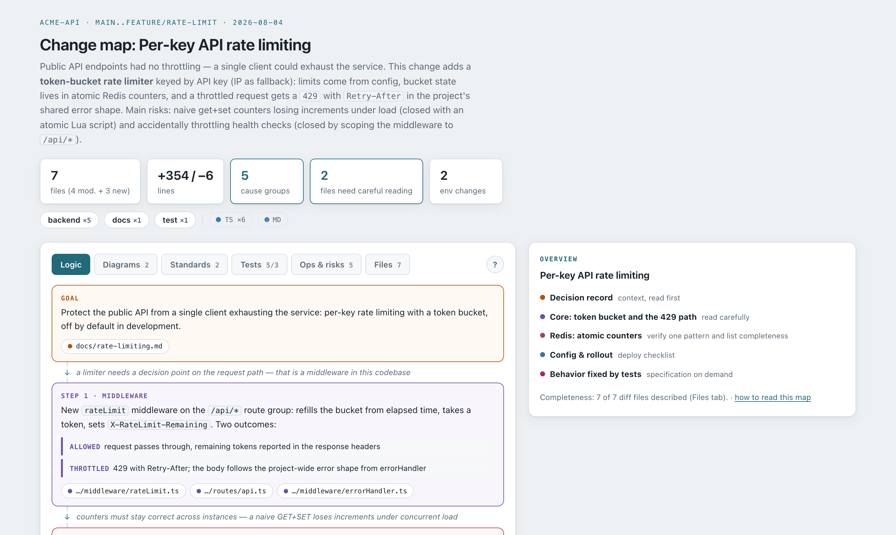
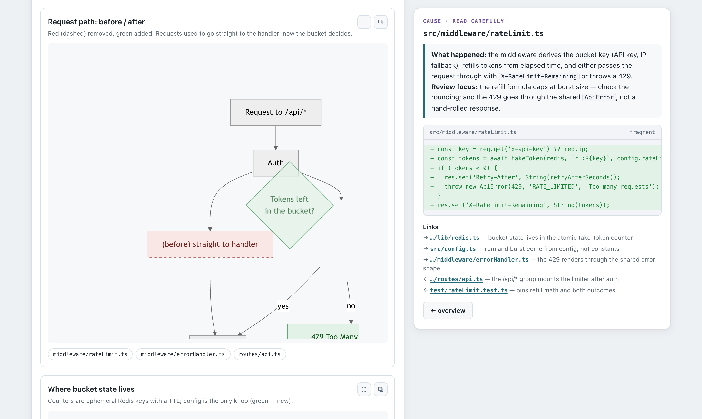
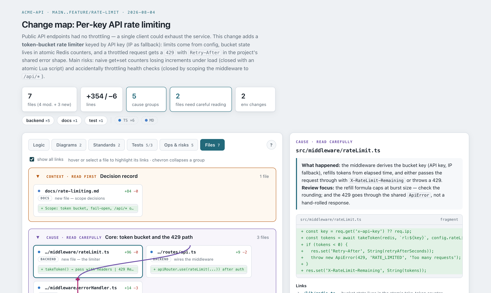

# whydiff

[](https://github.com/smagew/whydiff/actions/workflows/validate.yml)
[](LICENSE)

**Follow the meaning of a change — the architectural and logical decisions
behind it — instead of reading thousands of diff lines to reconstruct them.**

whydiff is a Claude Code plugin that turns any git diff into an interactive
**review map**: a causal story of *why* each change exists, changes grouped by
cause instead of by file, diagrams of the flows and data shapes that actually
changed, plus standards / tests / ops reports and a blast radius — every claim
one click away from the code it came from.

An LLM writes code faster than anyone can read it. Reviewing every file line by
line burns the speed you just gained ("comprehension debt"); skipping the review
costs you your mental model of the project. whydiff is the third option: read
the decisions, open the code only where it matters, and let a script — not the
model — prove that no file went unexplained.

See `PLAN.md` for the problem statement and the design principles.



| Diff-marked diagrams — click a node to open the file | Cause groups with labeled links between files |
|---|---|
|  |  |

## Usage

```
/whydiff                    # working tree vs HEAD (incl. untracked)
/whydiff HEAD~3             # a commit range
/whydiff main..feature      # any git range
```

The skill produces `<repo>/.whydiff/<date>-<slug>.html` — a self-contained
page (mermaid inlined, no network needed) — and opens it.

The report language follows the conversation language; source code and
identifiers are always English (see principle 8 in `PLAN.md`).

## Install

The repo doubles as a plugin marketplace (`.claude-plugin/marketplace.json`),
so a normal persistent install works from a local path or from GitHub —
no `--plugin-dir` needed, the plugin is then available in every session:

```
/plugin marketplace add smagew/whydiff       # straight from GitHub
/plugin marketplace add /path/to/whydiff     # or a local clone
/plugin install whydiff@whydiff
```

The mermaid bundle for the assembler is installed automatically on first
`/whydiff` run (`npm install` inside the plugin directory).

Plugin skills are namespaced: invoke as `/whydiff:whydiff` (the bare
`/whydiff` form also resolves when unambiguous).

### Permissions

The plugin ships a `PreToolUse` hook that auto-approves **only** the
pipeline's own operations, so a `/whydiff` run doesn't ask a dozen times:
its bundled scripts (`manifest/validate/assemble/timing.mjs`), read-only git
(`diff`/`log`/`show`/`ls-files`/`status`), writes into `.whydiff/`, and
opening the built map. Commands with chaining or substitution
(`;`, `&`, `|`, `` ` ``, `$(`) are never auto-approved, and everything else
goes through the normal permission flow (see `scripts/approve.mjs` — it is
deliberately short and reviewable).

Local development (changes picked up without reinstalling):

```bash
cd /path/to/whydiff && npm install   # pulls mermaid for the assembler
claude --plugin-dir /path/to/whydiff
# inside the session: /reload-plugins after edits
claude plugin validate /path/to/whydiff   # schema check before distributing
npx playwright install chromium && npm test   # browser smoke test (CI runs it too)
```

To update an installed copy after new commits: `/plugin marketplace update whydiff`.

Releasing: bump `version` in `.claude-plugin/plugin.json` **and**
`.claude-plugin/marketplace.json`, add a `CHANGELOG.md` entry, tag `vX.Y.Z` —
installed users only receive updates when the version changes.

## Layout

```
.claude-plugin/plugin.json   # plugin manifest
skills/whydiff/SKILL.md      # the /whydiff pipeline (orchestration)
agents/                      # parallel analysis passes
  classifier.md              #   groups, story, files, edges, ops
  diagrammer.md              #   diff-marked mermaid diagrams
  standards-reviewer.md      #   project-convention findings + blast radius
  tests-analyst.md           #   fixed behaviors + gap analysis
hooks/hooks.json             # PreToolUse hook wiring (see Permissions)
scripts/
  manifest.mjs               # deterministic diff manifest from git
  validate.mjs               # structure + manifest-vs-git cross-check
  assemble.mjs               # review-map.json + viewer template → HTML
  timing.mjs                 # per-run timing log + timing-report.md
  approve.mjs                # auto-approves only this pipeline's own calls
  lib.mjs                    # shared validation/git helpers
templates/viewer.html        # the generic viewer (i18n, mermaid, 6 tabs)
schema/review-map.schema.json# the generator↔viewer contract
examples/rate-limit/         # hand-authored reference sample (synthetic project)
tests/smoke.mjs              # assemble + headless-browser check of the viewer
```

## What the map answers

| Question | Where it lands |
|---|---|
| What decisions were made, and why this one led to the next? | **Logic** — causal story, each block linked by a *why* |
| Which flows / data shapes actually changed? | **Diagrams** — one diff-marked graph per changed flow; `er-diff` for schema migrations |
| Which parts of the project are touched? | Scope tags + language dots above the tabs |
| Does it follow this project's conventions? | **Standards** — findings with the convention they deviate from |
| What is now guaranteed, and what is still uncovered? | **Tests** — fixed behaviors vs gap analysis |
| What do I do at deploy time? | **Ops & risks** — env/migrations/deploy + blast radius |
| Was anything left unexplained? | **Files** — N of N manifest, proven by `validate.mjs` |

## Pipeline (what /whydiff does)

1. `manifest.mjs` — deterministic file list from git (incl. untracked).
2. The main model reads the diff, then fans out four plugin agents in parallel.
3. Their JSON is merged into `review-map.json` per the schema.
4. `validate.mjs` — structural integrity + cross-check against the real diff;
   errors are fixed and re-validated until clean (completeness is proven by
   script, never asserted by the LLM).
5. `assemble.mjs` — self-contained HTML with the mermaid bundle inlined.
