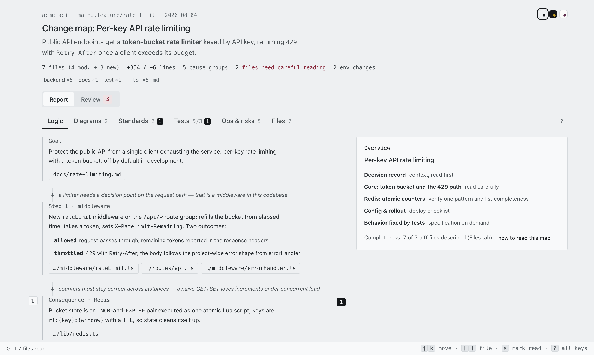
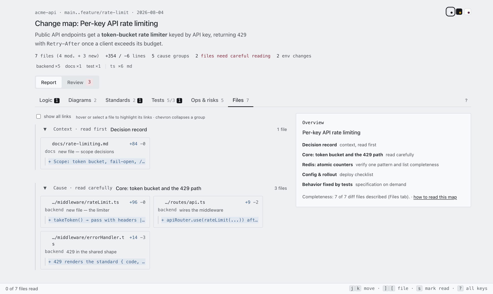
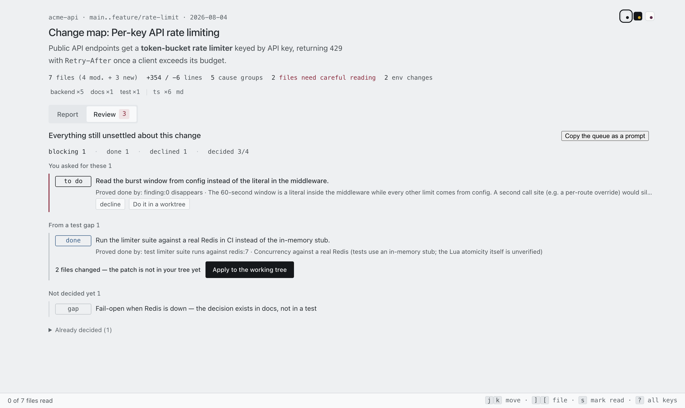
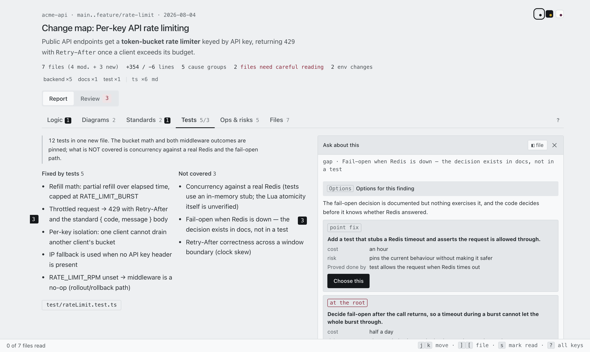

# whydiff

[](https://github.com/smagew/whydiff/actions/workflows/validate.yml)
[](LICENSE)

**Follow the meaning of a change — the architectural and logical decisions
behind it — instead of reading thousands of diff lines to reconstruct them.**

whydiff is a Claude Code plugin that turns any git diff into an interactive
**review map**: a causal story of *why* each change exists, changes grouped by
cause instead of by file, diagrams of the flows and data shapes that actually
changed, the user stories the change actually delivers (and the ones it breaks),
plus standards / tests / ops reports and a blast radius — every claim one click
away from the code it came from.

An LLM writes code faster than anyone can read it. Reviewing every file line by
line burns the speed you just gained ("comprehension debt"); skipping the review
costs you your mental model of the project. whydiff is the third option: read
the decisions, open the code only where it matters, and let a script — not the
model — prove that no file went unexplained.

See `PLAN.md` for the problem statement and the design principles.

<!-- Screenshots carry the version they show: a changed picture gets a new filename,
     so neither a browser nor GitHub's CDN can keep serving the previous one. When you
     re-shoot, rename to the version being released and update these links. -->



| Diff-marked diagrams — click a node to open the file | Cause groups with labeled links between files |
|---|---|
|  |  |
| **Review** — the merge gate: what blocks, grouped by where each problem came from, a patch waiting to be applied, and the decision manifest | **Options** — two or three ways to deal with a finding, differing in kind, each with its cost, risk and the criterion it would be judged by |
|  |  |

## Usage

```
/whydiff                    # working tree vs HEAD (incl. untracked)
/whydiff HEAD~3             # a commit range
/whydiff main..feature      # any git range
```

The skill produces `<repo>/.whydiff/<date>-<slug>.html` — a self-contained
page (mermaid inlined, no network needed) — and opens it.

The report language follows the conversation language; source code and
identifiers are always English (see principle 8 in `PLAN.md`).

## Install

The repo doubles as a plugin marketplace (`.claude-plugin/marketplace.json`),
so a normal persistent install works from a local path or from GitHub —
no `--plugin-dir` needed, the plugin is then available in every session:

```
/plugin marketplace add smagew/whydiff       # straight from GitHub
/plugin marketplace add /path/to/whydiff     # or a local clone
/plugin install whydiff@whydiff
```

The mermaid bundle for the assembler is installed automatically on first
`/whydiff` run (`npm install` inside the plugin directory).

Plugin skills are namespaced: invoke as `/whydiff:whydiff` (the bare
`/whydiff` form also resolves when unambiguous).

### Permissions

The plugin ships a `PreToolUse` hook that auto-approves **only** the
pipeline's own operations, so a `/whydiff` run doesn't ask a dozen times:
its bundled scripts (`manifest/validate/assemble/timing.mjs`), read-only git
(`diff`/`log`/`show`/`ls-files`/`status`), writes into `.whydiff/`, and
opening the built map. Commands with chaining or substitution
(`;`, `&`, `|`, `` ` ``, `$(`) are never auto-approved, and everything else
goes through the normal permission flow (see `scripts/approve.mjs` — it is
deliberately short and reviewable).

## Development loop (no push required)

Installing from a marketplace copies the plugin into
`~/.claude/plugins/cache/…`, so a *copy* is what runs. To test the working tree
instead, load it directly — `--plugin-dir` reads from disk and overrides an
installed copy of the same plugin for that session:

```bash
make check              # contract + viewer + manifest checks, no LLM (~20s)
make preview            # assemble the reference example and open it
make fixtures           # list the fixture projects
make run-synthetic      # build a fixture and open Claude with THIS working tree
make report-synthetic   # per-phase timing of the last run there
make map-synthetic      # open the HTML map that run produced
```

Inside the session: `/whydiff HEAD~1..HEAD`. Skill edits apply immediately;
after editing `agents/` or `hooks/`, run `/reload-plugins`.

**Fixtures** (`tests/fixtures/fixtures.json`) are real diffs from popular
open-source repos, pinned by SHA and fetched with `--depth 2`, so preparing one
takes seconds and the diff is always `HEAD~1..HEAD`. Their recorded GitHub
stats are cross-checked against our own manifest, so a fixture also tests
`manifest.mjs`:

| fixture | diff | what it exercises |
|---|---|---|
| `synthetic` | 10 files, TS/PHP/SQL/MD (generated locally, no network) | scope tags, language dots, `er-diff`, ops/migrations |
| `quick` | expressjs/express — 3 files | smallest end-to-end sanity run |
| `feature` | honojs/hono — 4 files | cause groups, story chain, tests tab |
| `migration` | zulip/zulip — 8 files, Django migration | schema diagram, cross-layer edges |
| `big` | mastodon/mastodon — 63 files, Rails migration | classifier sharding, verify-pattern, blast radius |

Fixtures land in `.fixtures/` (gitignored); `make clean-fixtures` removes them.
`synthetic` and `quick` are a few hundred KB to ~2 MB; `migration` and `big`
pull ~150–200 MB each because those repos have large trees even at depth 2.

Prerequisites: `npm install` (mermaid for the assembler) and
`npx playwright install chromium` (for `npm test`).

To update an installed copy after new commits: `/plugin marketplace update whydiff`.

Releasing: bump `version` in `.claude-plugin/plugin.json` **and**
`.claude-plugin/marketplace.json`, add a `CHANGELOG.md` entry, tag `vX.Y.Z` —
installed users only receive updates when the version changes.

## Layout

```
.claude-plugin/plugin.json   # plugin manifest
skills/whydiff/SKILL.md      # the /whydiff pipeline (orchestration)
skills/whydiff-work/SKILL.md # /whydiff-work: do the tasks agreed in a review
agents/                      # parallel analysis passes
  classifier.md              #   groups, story, files, edges, ops
  diagrammer.md              #   diff-marked mermaid diagrams
  standards-reviewer.md      #   project-convention findings + blast radius
  tests-analyst.md           #   fixed behaviors + gap analysis
  story-writer.md            #   user stories + a verdict on each
hooks/hooks.json             # PreToolUse hook wiring (see Permissions)
scripts/
  manifest.mjs               # deterministic diff manifest from git
  shards.mjs                 # balances the classifier split against a time budget
  merge.mjs                  # agent output files → review-map.json
  validate.mjs               # structure + manifest-vs-git cross-check
  assemble.mjs               # review-map.json + viewer template → HTML
  serve.mjs                  # optional: serve the map + answer questions via claude -p
  timing.mjs                 # per-run timing log + timing-report.md
  approve.mjs                # auto-approves only this pipeline's own calls
  review.mjs                 # the review journal: append-only log + its projection
  rebind.mjs                 # re-attaches the journal to a regenerated map
  lib.mjs                    # shared validation/git/fragment helpers
templates/viewer.html        # the generic viewer (i18n, mermaid, 7 tabs)
schema/review-map.schema.json# the generator↔viewer contract
examples/rate-limit/         # hand-authored reference sample (synthetic project)
tests/merge.mjs              # merge contract: git wins over the model
tests/shards.mjs             # shard planner: balance, coverage, budget overflow
tests/smoke.mjs              # assemble + headless-browser check of the viewer
tests/serve.mjs              # serve contract: token gating, ask/instruct/options, Tasks tab
tests/review.mjs             # review journal: refusals, task states, coverage, migration
tests/work.mjs               # serve --work: worktree isolation, patch, apply gate
tests/rebind.mjs             # rebinding: moved / stale / revived, and idempotence
tests/design.mjs             # design system: tokens, contrast band, shadows, measure
```

## What the map answers

| Question | Where it lands |
|---|---|
| What decisions were made, and why this one led to the next? | **Logic** — causal story, each block linked by a *why* |
| What changed for the people using this, and did it actually land? | **User stories** — one story per outside-visible capability, each with a `delivered` / `partial` / `broken` / `regressed` verdict read off the code |
| Which flows / data shapes actually changed? | **Diagrams** — one diff-marked graph per changed flow; `er-diff` for schema migrations |
| Which parts of the project are touched? | Scope tags + language dots above the tabs |
| Does it follow this project's conventions? | **Standards** — findings with the convention they deviate from |
| What is now guaranteed, and what is still uncovered? | **Tests** — fixed behaviors vs gap analysis |
| What do I do at deploy time? | **Ops & risks** — env/migrations/deploy + blast radius |
| Was anything left unexplained? | **Files** — N of N manifest, proven by `validate.mjs` |
| I have a question about *this* bit | `serve.mjs` — select a story, Logic block(s), a diagram node or any text and ask; answered by `claude -p` against the real repo. Local-only, see below |
| This bit should change | `serve.mjs` — the same panel, switched to **Instruct**: Claude replies with a *plan* (files, what proves it done, blast radius, open questions) that you agree to or turn down. Agreeing opens a task in the review journal; nothing is edited |
| What are my options for this problem? | **Options** — the third panel mode, offered only on a problem the map found: two or three ways to deal with it that differ in *kind* (point fix / at the root / pin it instead), each with cost, risk, blast radius and the criterion it would be judged by. Choosing one opens the task |
| Can I merge this yet? | **Tasks** — the verdict line says what still blocks, grouped by where the problem came from, with unanswered questions in the same list. One button copies the agreed queue as a prompt for your session |

### Asking — and instructing — from inside the map

The assembled report is a single self-contained file, and a published artifact's
CSP blocks every outgoing request — so the page has no way to reach a model on its
own. `scripts/serve.mjs` trades that self-containment for a live answer:

```bash
node scripts/serve.mjs .whydiff/review-map.json --repo . --port 7777
```

Anchors are a user-story card, a Logic block (⌘/Ctrl-click several to ask about the
set), a diagram (Alt-click a single node), or any text selection. Answers land in
`.whydiff/review.log.jsonl` — the review journal — and come back on the next serve.

Each question leaves a numbered pin where it was asked — selected text stays
highlighted, like a comment in a document — and a bookmark in the left rail at the
height of its anchor; bookmarks for other tabs stack at the top and switch tab when
clicked. The answer streams, showing the model's steps while it works and folding
them away once it replies.

The ask UI is gated on a token this server injects, so it is **absent** — not
broken — in the file on disk and in the published artifact. `tests/serve.mjs`
asserts exactly that, with the CLI stubbed so the suite never calls a model.

The panel has a second mode, **Instruct**: instead of asking about the anchored
place, say what should change there. The reply is a **plan** — file by file, what
will prove it done, what could break, what must be answered first — and two
buttons: agree, which opens a task in the journal, or not now, which is recorded so
the offer is not made again. Nothing is executed and nothing is edited: the CLI is
spawned with a read-only allowlist *and* an explicit deny list for the editing tools,
the shell and subagents, and the task is a queue your own Claude Code session
drains. The design is in [`docs/review-loop.md`](docs/review-loop.md).

Those decisions collect in a **Tasks** tab, which exists only on the served copy.
It is a merge gate rather than a to-do list: the header says `blocking N` — or
`nothing blocking`, when that is true — cards are grouped by where the problem came
from (your instructions, a broken user story, a standards finding, a test gap),
questions nobody answered sit in the same list, and every card links back to the
place in the report it came from. Declining asks for a reason, because the journal
refuses a decline without one. **Copy the queue as a prompt** hands the agreed tasks
to your session, with each acceptance criterion attached — where
[`/whydiff-work`](skills/whydiff-work/SKILL.md) picks them up.

The header also carries the **decision manifest** — `decided 3/7` — and the findings
nobody has answered are listed, not just counted. It is the same guarantee as the
file manifest, applied to decisions: every problem the map reported either has a
decision or is openly undecided.

### Doing the agreed work in the report itself

`serve.mjs --work` (opt-in) adds one button to an agreed task: **do it in a
worktree**. An agent works the task in a throwaway `git worktree` seeded from your
working tree as it stands — never in your checkout — and hands back a patch. The
patch is shown as a change to read, and reaches your tree only through **apply**.

```bash
node scripts/serve.mjs .whydiff/review-map.json --repo . --work
```

That closes the loop this tool exists for: an LLM edit does not land in the tree
without having been looked at as a change. A patch that no longer applies is
reported, never forced; a run that produced nothing says so and hands the task back
rather than recording a resolution it does not have. Without `--work` the endpoints
are refused outright — that server reads and plans, and says so on startup.

Worktree isolation protects your **files**, not your machine: the worker can run
commands (that is how it runs the test its criterion names), which is exactly why
the mode is opt-in.

### Doing the agreed work in your session

`/whydiff-work` is the other half of the loop: it drains the queue in your own
session — full context, ordinary permission flow, nothing running behind an HTTP
endpoint. One task at a time, oldest first:

```bash
R="node scripts/review.mjs .whydiff"
$R --next                              # the next task, its criterion, its discussion
$R --start <taskId>                    # claim it, so the page shows it as taken
$R --resolve <taskId> --patch .whydiff/tasks/<taskId>.patch --files a,b
$R --verify <taskId> --evidence "npm test -t refunds → 1 passed"
```

Two rules the skill keeps and the journal enforces. **The spec is the boundary** —
work that turns out to need something nobody agreed to stops and reports instead of
widening. And **verification is earned, not asserted**: `done` means changed,
`verified` needs the command and its real output, and only a `test` criterion is the
working session's to close — a `story` or `finding` criterion is closed by
regenerating the map and seeing it flip, `manual` by the reviewer.

## Pipeline (what /whydiff does)

1. `manifest.mjs` — deterministic file list from git (incl. untracked).
2. The main model reads the diff and writes a briefing for the agents.
3. `shards.mjs` — splits the classifier's file list so the slowest shard fits a
   wall-clock budget. A shard's runtime is set by how many bytes it writes and
   nothing else, so the split is arithmetic, not judgment.
4. Four plugin agents run in parallel; **each writes its own JSON file** and
   returns one line. Nobody retypes an agent's answer.
5. `merge.mjs` — combines those files into `review-map.json`. Anything a script can
   know comes from the script: line counts and new-file flags from git, code
   fragments from the patch. The model supplies only what it alone can — the
   causal narrative and the per-file *why*.
6. `validate.mjs` — structural integrity + cross-check against the real diff;
   errors are fixed and re-validated until clean (completeness is proven by
   script, never asserted by the LLM).
7. `assemble.mjs` — self-contained HTML with the mermaid bundle inlined.
